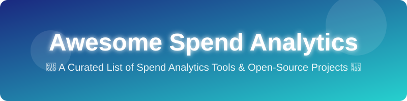

  

<h1 align="center">Awesome Spend Analytics 💸</h1>

  
  
  

## 🌟 Top Spend Analytics Tools Ecosystem

**Curated List of SaaS/Commercial Products & Open-Source GitHub Projects** ✨  
*Focused on Spend Classification, Visibility, Tail Spend Analysis, Procurement Intelligence & Savings Identification*  
**Last updated: August 2026**

This repository tracks notable **SaaS platforms** and **open-source projects** for **Spend Analytics**. These tools help procurement and finance teams cleanse, classify, and analyze purchasing data to gain visibility into spend, identify savings opportunities, detect maverick buying, and support strategic sourcing decisions. 🚀

Contributions welcome! 🤝 Open a PR to add/update entries. Keep descriptions factual and link to official sites.

## 📑 Table of Contents
- [SaaS/Hosted Platforms](#saas-products)
- [Open-Source GitHub Projects](#open-source-github-projects)
- [How to Contribute](#how-to-contribute)
- [Disclaimer](#disclaimer)

## 🏢 SaaS/Hosted Platforms

| Product | Description | Pricing | Free Tier Limit | Estimated Revenue / Valuation |
|---------|-------------|---------|-----------------|-------------------------------|
| **[SAP Ariba Spend Analysis](https://www.sap.com/products/spend-management/ariba.html)** | Enterprise spend analysis tightly integrated with SAP Ariba and broader SAP procurement ecosystems. | Custom / Contact Sales | N/A | $30B+ (SAP) |
| **[Tableau Procurement Analytics](https://www.tableau.com/)** | General BI applied to procurement data, highly configurable. | Custom / Contact Sales | N/A | $2B+ (Tableau) |
| **[Coupa Spend Analysis / Spend Guard](https://www.coupa.com/)** | Spend analytics capabilities embedded within the Coupa Business Spend Management suite. | Custom / Contact Sales | N/A | $1B+ |
| **[GEP SMART](https://www.gep.com/)** | Unified source-to-pay platform with strong spend analytics, strategic sourcing, and procurement transformation capabilities. | Custom / Contact Sales | N/A | $1B+ |
| **[Medius Analytics](https://www.medius.com/)** | Further options covering invoice-to-pay analytics and spend visibility. | Custom / Contact Sales | N/A | $100M+ |
| **[Ivalua](https://www.ivalua.com/)** | Mid-market and enterprise spend visibility and configurable procurement analytics. | Custom / Contact Sales | N/A | $100M+ |
| **[Zycus](https://www.zycus.com/)** | Suite-based platforms focused on spend visibility, classification, and procurement insights. | Custom / Contact Sales | N/A | $100M+ |
| **[Proactis](https://www.proactis.com/)** | Spend management for mid-market organizations. | Custom / Contact Sales | N/A | $50M+ |
| **[Sievo](https://sievo.com/)** | Leading dedicated spend analytics platform specializing in AI-powered classification and multi-ERP data unification. | Custom / Contact Sales | N/A | $50M+ |
| **[SpendHQ](https://spendhq.com/)** | Specialized platforms focused on spend visibility, classification, and procurement insights. | Custom / Contact Sales | N/A | $50M+ |
| **[Simfoni](https://simfoni.com/)** | Specialized spend visibility platform. | Custom / Contact Sales | N/A | $20M+ |
| **[Procurify Analytics](https://www.procurify.com/)** | Modern spend management software. | Custom / Contact Sales | N/A | $20M+ |
| **[Rosslyn Analytics](https://www.rosslynanalytics.com/)** | Spend visibility, classification, and procurement insights. | Custom / Contact Sales | N/A | $10M+ |

## 🌐 Open-Source GitHub Projects

- **[apache/superset](https://github.com/apache/superset)**   
  Leading open-source BI and data visualization platform frequently used to build custom spend dashboards and analytics on top of cleaned procurement data.

- **[metabase/metabase](https://github.com/metabase/metabase)**   
  Open-source BI and data visualization platform frequently used to build custom spend dashboards and analytics on top of cleaned procurement data.

- **[frappe/erpnext](https://github.com/frappe/erpnext)**   
  Open-source ERP with purchasing, supplier, and basic spend reporting capabilities that can serve as data sources or lightweight analytics foundations.

- **[cube-js/cube](https://github.com/cube-js/cube)**   
  Headless BI platform for building data applications, useful for custom spend analytics architectures.

- **[lightdash/lightdash](https://github.com/lightdash/lightdash)**   
  Open-source BI for dbt, ideal for modern spend data pipelines.

- **[evidence-dev/evidence](https://github.com/evidence-dev/evidence)**   
  Business intelligence as code; build fast, interactive spend reports with SQL and Markdown.

- **[Wondermove-Inc/saaslens](https://github.com/Wondermove-Inc/saaslens)**   
  Open-source SaaS spend intelligence platform for discovering unused subscriptions, matching payments to apps, tracking seats, and analyzing departmental SaaS costs.

- **[virbahu/procurement-optimization](https://github.com/virbahu/procurement-optimization)**   
  AI-driven open-source initiatives that include spend classification, tail-spend analysis, maverick spend detection, and strategic sourcing optimization components.

### ➕ Additional Strong Open-Source Options
- Custom UNSPSC or commodity classification models trained on open or internal datasets. 📦
- dbt projects and SQL models for spend cube construction and hierarchy management. 📊
- Integration of open procurement data with modern lakehouse architectures. 🏗️

## 🛠️ How to Contribute

1. Fork the repo.
2. Add/edit entries in `README.md` (follow existing format).
3. Include: name, link, 1–2 sentence description, and whether it's SaaS/commercial or open-source.
4. Submit PR with a short explanation.

Star the repo if you find it useful! ⭐

## ⚠️ Disclaimer

- This is a **community-curated** list — not exhaustive and not an endorsement.
- Effective spend analytics depends heavily on data quality, taxonomy management, and multi-source integration. Open-source tools and BI platforms can deliver strong visibility when properly implemented, but dedicated commercial solutions often provide superior classification accuracy, enrichment services, and procurement-specific workflows out of the box.
- Always validate classification results and savings opportunities with procurement and finance stakeholders before acting on insights.

---

**Made for procurement analysts, spend managers, and data teams seeking greater transparency and control over spend data.** 📈  
Let's make procurement intelligence more open and accessible.

## ⭐ Star History

<a href="https://www.star-history.com/?repos=ishandutta2007/Awesome-Spend-Analytics&type=date&legend=bottom-right">
<picture>
<source media="(prefers-color-scheme: dark)" srcset="https://api.star-history.com/chart?repos=ishandutta2007/Awesome-Spend-Analytics&type=date&theme=dark&legend=bottom-right" />
<source media="(prefers-color-scheme: light)" srcset="https://api.star-history.com/chart?repos=ishandutta2007/Awesome-Spend-Analytics&type=date&legend=bottom-right" />

</picture>
</a>

